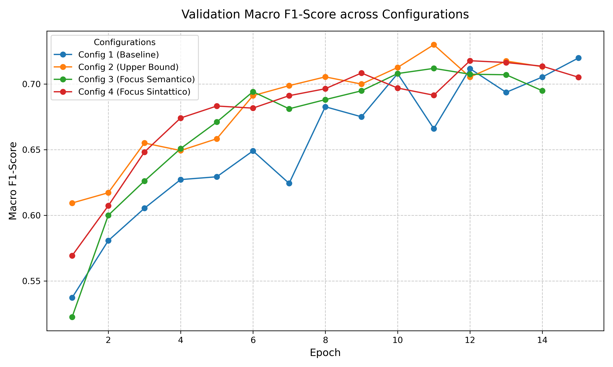
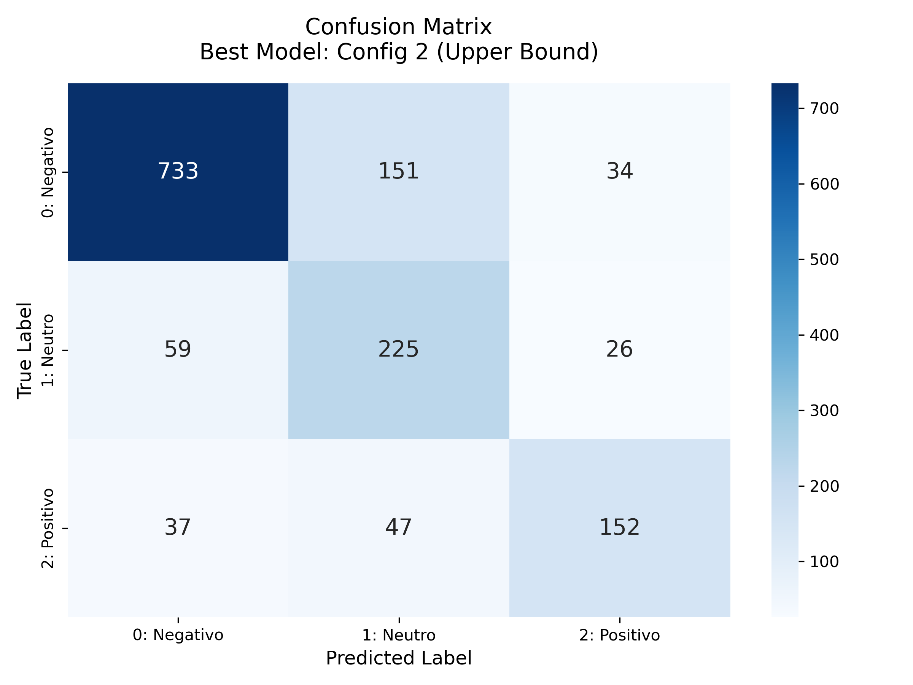

# US Airline Sentiment Analysis via Custom BiLSTM


A from-scratch deep learning pipeline for 3-class sentiment classification of **14,640 tweets** directed at US airlines. The model is a custom **Bidirectional LSTM** built in **pure PyTorch** — no Transformers, no deprecated third-party NLP libraries — with rigorous attention to reproducibility, data integrity, and class imbalance.

---

## Table of Contents

- [Overview](#overview)
- [Setup & Reproducibility](#setup--reproducibility)
- [How to Run](#how-to-run)
- [Model Checkpoints](#model-checkpoints)
- [Architectural Design Choices](#architectural-design-choices)
- [Handling Class Imbalance](#handling-class-imbalance)
- [Grid Search & Experiments](#grid-search--experiments)
- [Final Results on Test Set](#final-results-on-test-set)
- [Project Structure](#project-structure)

---

## Overview

The dataset `kaggle_dataset_clean.csv`  is a custom, pre-processed version of the [Twitter US Airline Sentiment](https://www.kaggle.com/datasets/crowdflower/twitter-airline-sentiment) corpus from Kaggle. It contains tweets labelled as **Negative** (~63%), **Neutral** (~21%), or **Positive** (~16%), making it a strongly imbalanced multi-class classification problem. To ensure optimal modeling, the raw data was processed via a dedicated cleaning script `clean_dataset.py` to remove URLs, user mentions (`@handle`), and special characters, retaining only the pure linguistic content. The goal is to correctly identify sentiment even for the minority class, using a lightweight recurrent architecture that generalises well on short, noisy social media text.

**Key design principles:**
- Full determinism and reproducibility via a centralised `set_seed` function
- Strict vocabulary construction from training data only to prevent data leakage
- Class-balanced loss weighting to handle the skewed label distribution
- Macro F1-Score as the primary evaluation metric to give equal weight to every class

---

## Setup & Reproducibility

### Environment

```bash
# Create and activate the Conda environment
conda create -n sentiment_env python=3.10
conda activate sentiment_env
```

### PyTorch with CUDA 11.8

```bash
conda install pytorch torchvision torchaudio pytorch-cuda=11.8 -c pytorch -c nvidia
```

### Additional Dependencies

```bash
pip install scikit-learn pandas numpy matplotlib seaborn ipykernel
```

### Reproducibility — `set_seed(42)`

All stochastic components are anchored to a fixed seed before any data loading, model initialisation, or training begins:

```python
import random, os
import numpy as np
import torch

def set_seed(seed: int = 42) -> None:
    """Pin all random number generators for fully deterministic training."""
    random.seed(seed)
    os.environ["PYTHONHASHSEED"] = str(seed)
    np.random.seed(seed)
    torch.manual_seed(seed)
    torch.cuda.manual_seed_all(seed)
    torch.backends.cudnn.deterministic = True
    torch.backends.cudnn.benchmark = False
```

Calling `set_seed(42)` at the entry point of the notebook/script guarantees that every run — on the same hardware and software stack — produces bit-for-bit identical weights, metrics, and visualisations.

---

## How to Run

1. **Activate the environment** created during setup:

```bash
conda activate sentiment_env
```

2. **Launch the notebook** using Jupyter or open it directly in VS Code:

```bash
# Option A — Jupyter
jupyter notebook notebook/sentiment_analysis.ipynb

# Option B — VS Code
code notebook/sentiment_analysis.ipynb
```

3. **Execute all cells in sequence** from top to bottom. The notebook is structured as a self-contained pipeline:

   - Data loading and preprocessing
   - Vocabulary construction and dataset splitting
   - Model definition and hyperparameter grid search
   - Training with Early Stopping
   - Evaluation on the Test Set with full classification report and confusion matrix

> **Note:** If you want to skip training entirely and run inference directly on the Test Set, see the [Model Checkpoints](#model-checkpoints) section below.

---

## Model Checkpoints

The pre-trained weights of the best model (`best_overall_model.pth`) are included in the repository under the `checkpoints/` directory. This allows anyone who clones the project to **run inference on the Test Set immediately**, without launching a full training run.

To load the checkpoint and evaluate:

```python
model.load_state_dict(torch.load("checkpoints/best_overall_model.pth", map_location=device))
model.eval()
```

The full training code is still provided in the notebook for complete reproducibility — the checkpoint is an optional convenience for quick evaluation and portfolio demonstration.

---

## Architectural Design Choices

Every decision below was made deliberately and is justified by the nature of the problem.

### 1. Pure PyTorch — No Transformers, No `torchtext`

The model is implemented using only `torch.nn` primitives. `torchtext` is excluded because its tokenisation and vocabulary APIs have undergone breaking changes across versions and the library is effectively deprecated in modern workflows. Using vanilla PyTorch ensures long-term maintainability and full transparency over every step of the pipeline.

### 2. Vocabulary Built on Training Data Only

The vocabulary is constructed **exclusively** from the training split. Applying it to the validation and test sets without ever inspecting their token distribution prevents **data leakage**: the model cannot implicitly benefit from vocabulary statistics derived from held-out examples.

- **`<PAD>`** token (index `0`): used to fill sequences to a fixed length.
- **`<UNK>`** token (index `1`): maps any out-of-vocabulary token at inference time to a single, learnable representation.
- **`MAX_LEN = 32`**: a fixed padding/truncation length chosen to cover the vast majority of tweet lengths while keeping memory footprint minimal.

### 3. Embedding Layer Trained from Scratch

```python
self.embedding = nn.Embedding(
    num_embeddings=vocab_size,
    embedding_dim=embed_dim,
    padding_idx=0   # <PAD> gradients are zeroed out
)
```

Pre-trained embeddings (e.g. GloVe) were deliberately avoided to keep the architecture self-contained and university-reproducible without external downloads. The `padding_idx=0` argument ensures that the `<PAD>` vector remains the zero vector throughout training — its gradient is masked, so it never distorts the learned semantic space.

### 4. Single Bidirectional LSTM Layer

```python
self.bilstm = nn.LSTM(
    input_size=embed_dim,
    hidden_size=hidden_dim,
    num_layers=1,          # single layer — avoids overfitting on short sequences
    batch_first=True,
    bidirectional=True,
    dropout=0.0            # dropout only applied in the classifier head
)
```

Stacking multiple LSTM layers was deliberately ruled out. Tweets are short (mean ≈ 15 tokens after cleaning), and deeper recurrent stacks introduce additional parameters that overfit on such limited sequence lengths. A single BiLSTM captures both left-to-right and right-to-left context, which is essential for understanding negation and sarcasm patterns common in airline complaints.

### 5. Output Representation — Concatenation of Final Hidden States

```python
# h_n shape: (2, batch, hidden_dim)  — 2 directions
forward_h  = h_n[0]   # final hidden state, forward direction
backward_h = h_n[1]   # final hidden state, backward direction
combined   = torch.cat([forward_h, backward_h], dim=1)  # (batch, 2 * hidden_dim)
out        = self.classifier(self.dropout(combined))
```

The classifier receives the concatenation of the two final hidden states (one per direction), giving it a holistic summary of the entire sequence from both temporal perspectives before making a prediction.

---

## Handling Class Imbalance

The label distribution is severely skewed:

| Class    | Share  |
|----------|--------|
| Negative | ~63%   |
| Neutral  | ~21%   |
| Positive | ~16%   |

A naive cross-entropy loss would bias the model toward predicting *Negative* for nearly every input. Two complementary measures are applied to counteract this:

### Balanced Class Weights via Scikit-Learn

```python
from sklearn.utils.class_weight import compute_class_weight
import torch

class_weights = compute_class_weight(
    class_weight="balanced",
    classes=np.unique(y_train),
    y=y_train
)
weights_tensor = torch.tensor(class_weights, dtype=torch.float).to(device)
criterion = nn.CrossEntropyLoss(weight=weights_tensor)
```

`compute_class_weight("balanced")` computes per-class weights inversely proportional to their frequency. These weights are passed **dynamically** to `nn.CrossEntropyLoss`, penalising misclassifications of minority classes (Neutral, Positive) more heavily during backpropagation.

### Macro F1-Score as Primary Metric

Accuracy is a misleading metric on imbalanced data — a model that always predicts *Negative* would reach ~63% accuracy while being completely useless. **Macro F1-Score** computes F1 independently for each class and then averages them with **equal weight**, ensuring that performance on the minority Positive class matters as much as on the dominant Negative class.

---

## Grid Search & Experiments

A systematic grid search was conducted over **4 configurations**, varying three hyperparameters:

| Hyperparameter  | Values Explored |
|-----------------|-----------------|
| Embedding dim   | 64, 128         |
| Hidden dim      | 64, 128         |
| Dropout         | 0.3, 0.5        |

Each configuration was trained with **Early Stopping** (`patience = 3`) monitored on the **validation Macro F1-Score**, preventing overfitting and keeping training time bounded.

The best configuration achieved a **validation Macro F1-Score of ~0.73**.

**Validation F1 comparison across configurations:**



---

## Final Results on Test Set

### Classification Report

| Class       | Precision | Recall | F1-Score |
|-------------|-----------|--------|----------|
| Negative    | 0.88      | 0.80   | 0.84     |
| Neutral     | 0.53      | 0.73   | 0.61     |
| Positive    | 0.72      | 0.64   | 0.68     |
| **Macro Avg** | **0.71** | **0.72** | **0.71** |

### Analysis

The model demonstrates **strong isolation of Negative tweets** (Recall = 0.80, Precision = 0.88), which is the dominant class and also the one carrying the most actionable signal for airline customer service analytics.

The primary source of confusion is **between Negative and Neutral** tweets. This is a linguistically expected pattern: many negative airline experiences are expressed in a terse, factual tone (*"Flight delayed again, no updates from staff"*) that lacks explicit sentiment markers. Similarly, sarcasm — frequent in complaint tweets — can read as neutral to a lexicon-driven model. The confusion between these two classes is therefore *physiological* for this task, rather than a structural failure of the architecture.

The Positive class, despite being the smallest, achieves an F1 of 0.68, confirming that the balanced loss weighting successfully prevented it from being systematically ignored.

**Confusion Matrix — Best Model:**



---

## Project Structure

```
.
├── sentiment_bilstm.ipynb   # Full pipeline: preprocessing → training → evaluation
├── best_overall_model.pth   # Pre-trained weights of the best model
├── images/
│   ├── validation_f1_comparison.png
│   └── confusion_matrix_best_model.png
├── kaggle_dataset_clean.csv
├── clean_dataset.py                 # Script used for text cleaning and preprocessing
├── requirements.txt                 # Project dependencies
├── .gitignore                       # Git ignore rules
└── README.md
```

---

> **Course:** Deep Neural Networks — M.Sc. Computer Engineering  
> **University:** Università degli Studi dell'Aquila  
> **Academic Year:** 2025/2026  
> **Author:** Leonardo Pinterpe —  [GitHub](https://github.com/Lpint02)
